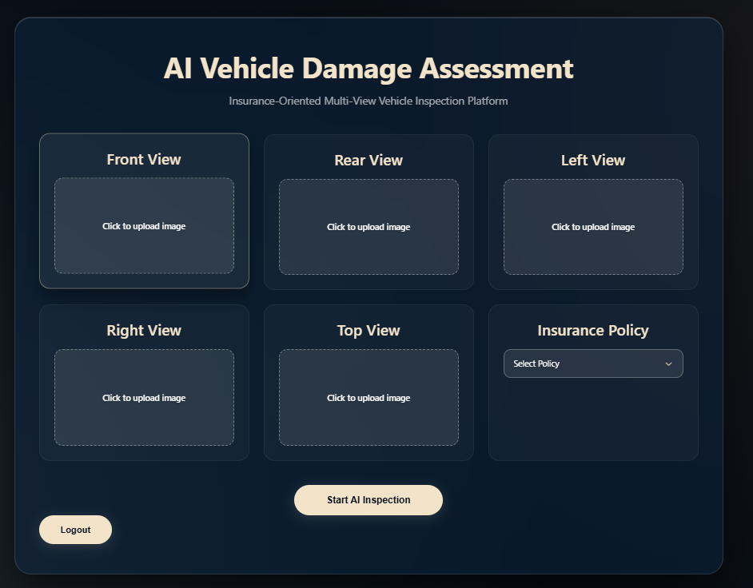
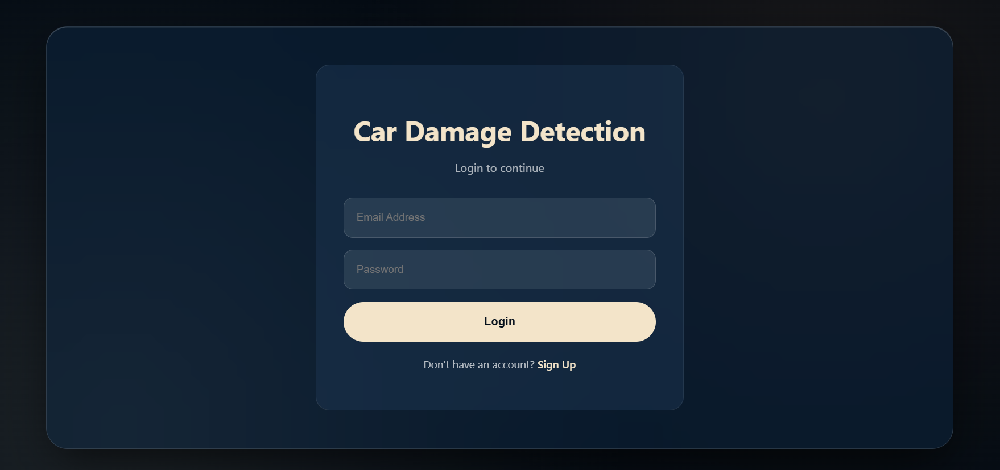
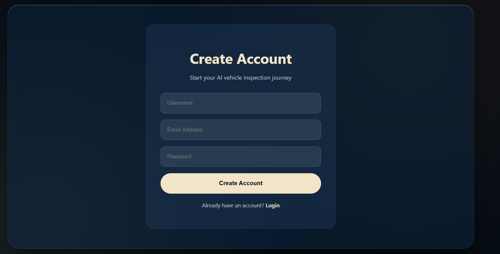
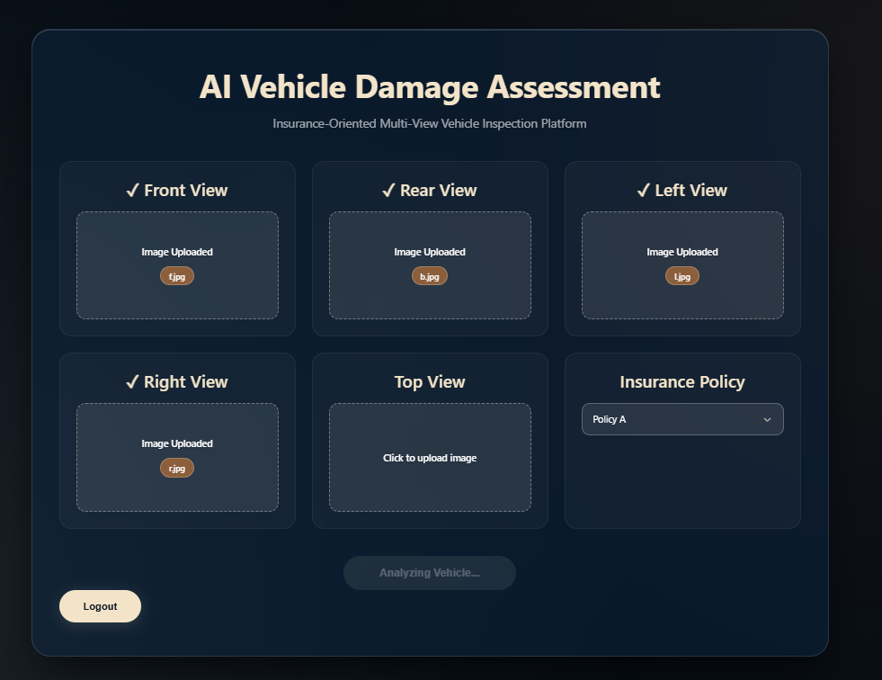
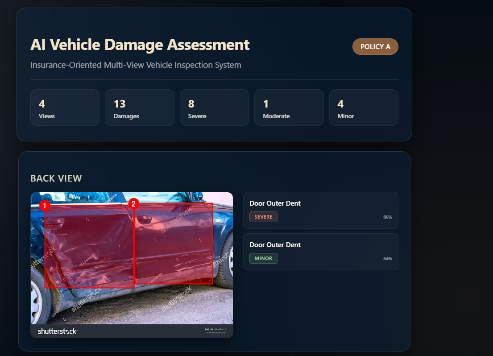
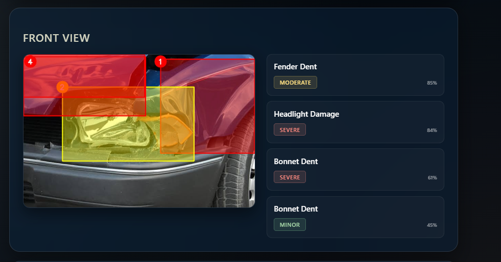
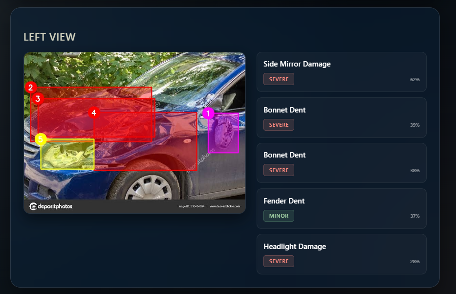
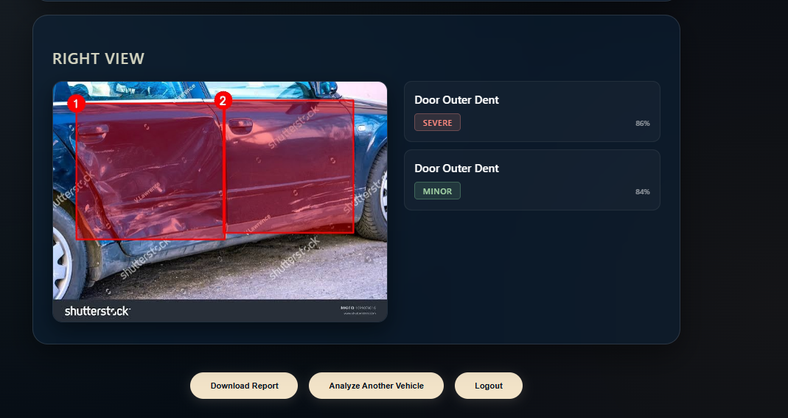

# 🚗 Car Damage Insurance System

### AI-Powered Vehicle Damage Detection, Severity Analysis & Insurance Cost Estimation

A full-stack AI-powered web application that automates vehicle damage assessment using Computer Vision and Deep Learning. The system detects vehicle damages from uploaded images, identifies affected vehicle parts, classifies damage severity, estimates repair costs based on insurance policies, and generates a professional PDF inspection report.

---

## ✨ Features

- 🚗 Multi-view vehicle inspection (Front, Back, Left & Right)
- 🤖 Vehicle damage detection using YOLO
- 🔧 Vehicle parts detection
- 📊 Damage severity classification using EfficientNetB0
- 💰 Insurance-aware repair cost estimation
- 📄 Automatic PDF inspection report generation
- 🌐 Modern React frontend with Flask backend
- ⚡ End-to-end AI inference pipeline

---

# 🏗️ System Architecture

```text
                    Vehicle Images
                          │
                          ▼
                  React Frontend
                          │
                    Upload Request
                          │
                          ▼
                    Flask Backend
                          │
          ┌───────────────┼───────────────┐
          │               │               │
          ▼               ▼               ▼
    Damage Model     Parts Model    Severity Model
       (YOLO)           (YOLO)      (EfficientNetB0)
          │               │               │
          └───────────────┼───────────────┘
                          ▼
             Damage–Part Association
                          │
                          ▼
            Insurance Cost Estimation
                          │
                          ▼
             PDF Report Generation
                          │
                          ▼
                 Results Dashboard
```

---

# 📸 Application Screenshots

## 🏠 Home Page



---

## 🔐 Login Page



---

## 📝 Sign Up Page



---

## 📤 Upload Vehicle Images



---

## 📊 Damage Detection Results

### Detection Overview









---

# 📄 Sample Generated Report

The application automatically generates a professional inspection report containing:

- Vehicle inspection summary
- Detected damages
- Damaged vehicle parts
- Severity assessment
- Estimated repair cost
- Insurance policy coverage

📥 **[View Sample Damage Report](sample_report/Damage_Report.pdf)**

---

# 🛠️ Tech Stack

| Category | Technologies |
|----------|--------------|
| **Frontend** | React, Vite, CSS |
| **Backend** | Flask, Python |
| **Deep Learning** | YOLO (Ultralytics), TensorFlow, Keras |
| **Computer Vision** | OpenCV |
| **Data Processing** | NumPy, Pandas |
| **Report Generation** | ReportLab |
| **Data Storage** | JSON |

---

# 📂 Project Structure

```text
Car-Damage-Detection/
│
├── backend/
│   ├── app.py
│   ├── config.py
│   ├── constants.py
│   ├── insurance.py
│   ├── models.py
│   ├── report_generator.py
│   ├── requirements.txt
│   ├── users.json
│   └── utils.py
│
├── frontend/
│   ├── public/
│   ├── src/
│   ├── package.json
│   └── vite.config.js
│
├── insurance_costs/
├── ml_models/
├── sample_report/
│   └── Damage_Report.pdf
│
├── screenshots/
│   ├── home_page.png
│   ├── login_page.png
│   ├── signup_page.png
│   ├── uploading.png
│   ├── result_page1.png
│   ├── result_page2.png
│   ├── result_page3.png
│   └── result_page4.png
│
├── static/
├── uploads/
├── class_names.json
├── classes.py
├── LICENSE
├── .gitignore
└── README.md
```

---

# 🚀 Installation

## Clone the Repository

```bash
git clone https://github.com/PV-Neeharikha/Car-damage-insurance-system.git
```

---

## Backend Setup

```bash
cd backend

python -m venv venv

# Windows
venv\Scripts\activate

# macOS/Linux
source venv/bin/activate

pip install -r requirements.txt

python app.py
```

---

## Frontend Setup

```bash
cd frontend

npm install

npm run dev
```

---

# 🔄 Application Workflow

1. Upload vehicle images from multiple viewpoints.
2. Detect damaged regions using the YOLO damage detection model.
3. Detect affected vehicle parts using the parts detection model.
4. Classify damage severity using EfficientNetB0.
5. Estimate repair costs using insurance policy datasets.
6. Generate a professional PDF inspection report.
7. Download the generated report directly from the application.

---

# 💡 Future Improvements

- 📱 Mobile application support
- 🎥 Real-time video damage detection
- ☁️ Cloud deployment
- 🚘 VIN-based vehicle identification
- 🤖 AI-powered repair recommendations
- 📝 Insurance claim management portal

---

# 👩‍💻 Author

**Neeharikha P V**

B.Tech Computer Science and Engineering  
Vellore Institute of Technology, Chennai

GitHub: https://github.com/PV-Neeharikha